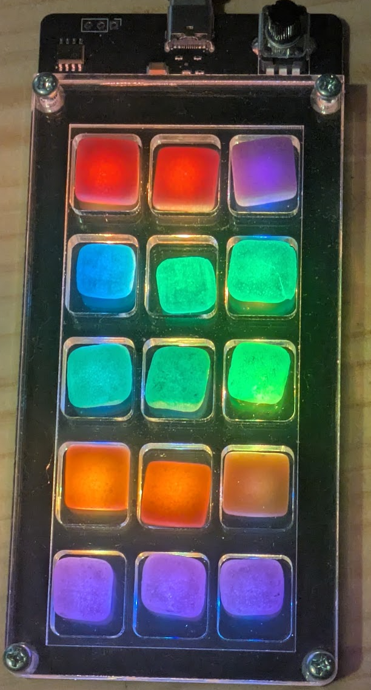
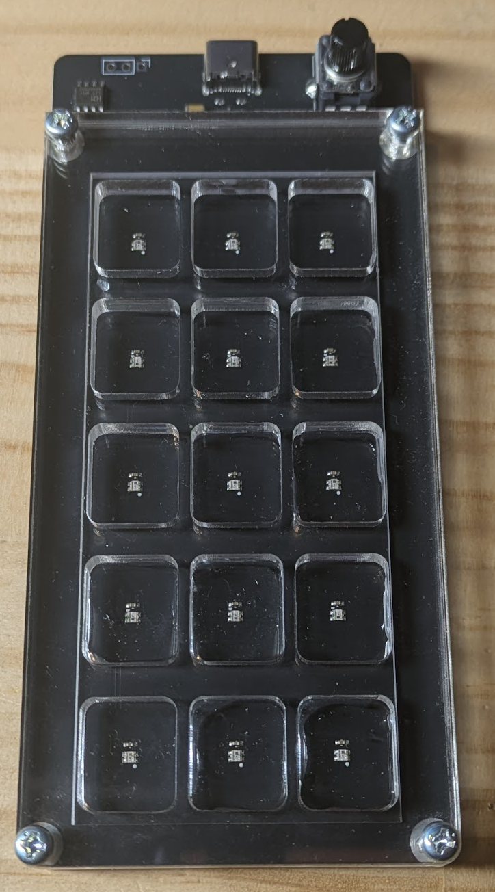

# フルーツ餅をかっこよくするやつ

駄菓子のフルーツ餅をDJやミュージシャンがカッコ良く使っているトリガーパッドっぽく光らせる装置です。

 
  

## 特徴

- ボリュームでテンポが変えられます

## キットに含まれるもの

- 部品実装済み基板
- ネジ M3 12mm: 4pcs.
- ナット M3: 4pcs.
- アクリル板1、2、3
- ゴム足: 4pcs.

## 必要なもの

- USB Type-C ケーブル、ACアダプターやPCなどの電源
- ドライバー
- フルーツ餅(15個)

## 組み立て方

- アクリル板の保護紙をはがします
- アクリル板1を基板の上に重ねます。
- アクリル板2を重ねます。
- アクリル板3を重ねます
- 全体を12mmのネジとナットで固定します。

## 使い方

- 餅を置きます。
- USBを接続すると光ります。
- お楽しみください！
