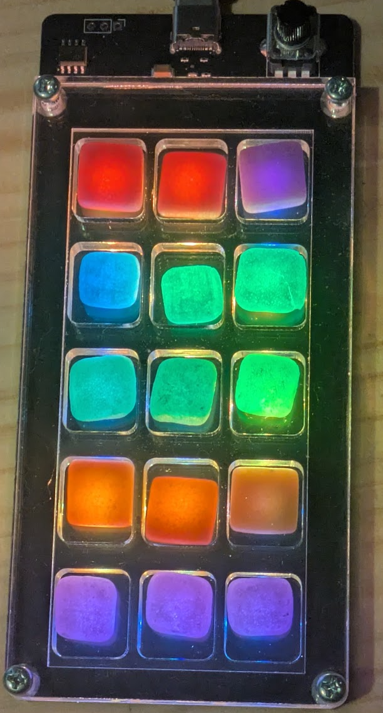
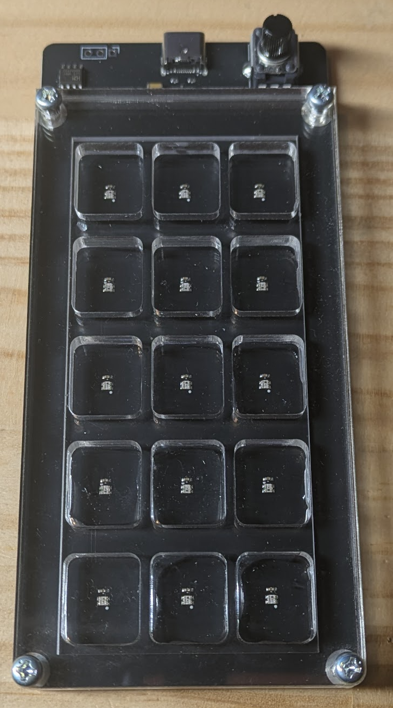
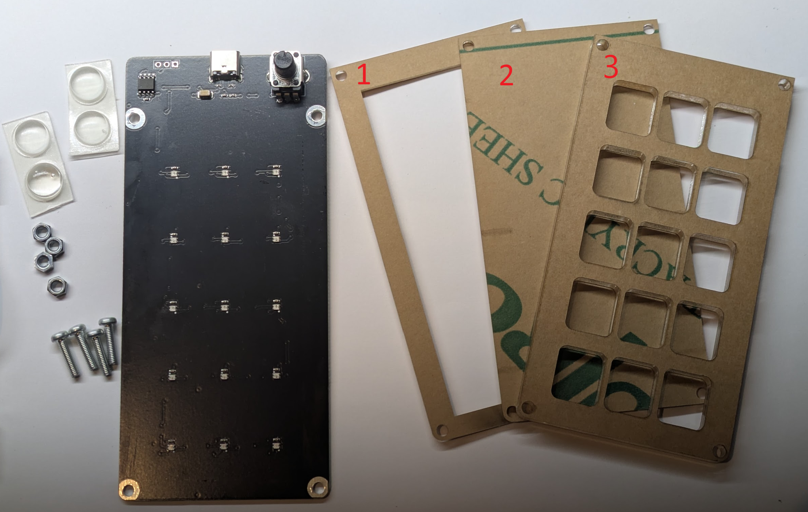

# Fruit Mochi Exciter

[日本語](README.ja.md)

Mochi(Fruit Mochi) is a famous Japanese sweets, which (from my perspective) looks like trigger pads what DJs/Musicians doing some kind of cool activities!
This product enables mochi lighting to derive full potential of the mochi itself...!

 
  

## Features

- Can change tempo via potentiometer

## Kit Contents

- Pre-assembled circuit board
- M3 12mm screws: 4pcs.
- M3 nuts: 4pcs.
- Acrylic boards(1, 2, 3)
- Rubber feets: 4pcs.

## What you will need

- USB Type-C cable, with connected to the power source(AC adapter, PC, etc.)
- Screwdriver
- Fruit Mochi: 15 pcs.

## How to assemble

- Remove the sealing paper on the accrylic boards.
- Put board 1 on the circuit board.
- Put board 2 on the board 1
- Put board 3 on the board 2
- Fix all with 12mm screws and nuts.

## How to use

- Place mochis on the board.
- Start lighting by connecting the USB.
- Enjoy!
